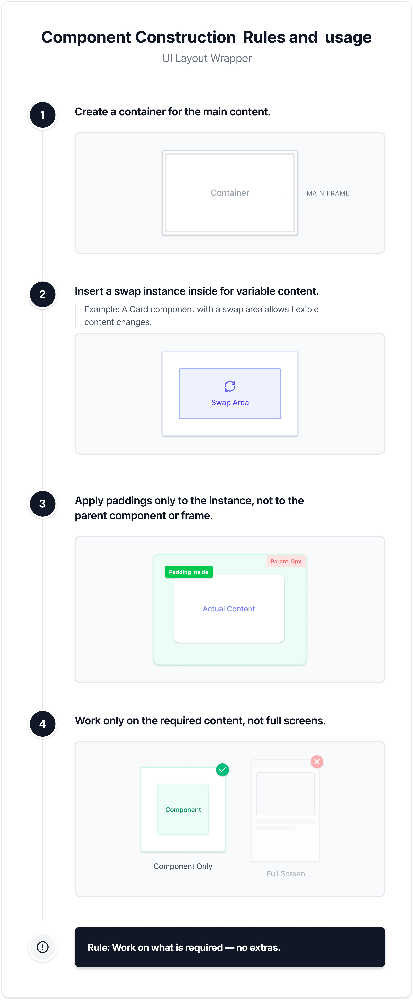

# DES-1 — Figma to devs, to AI, to everyone best practices

##1. Component Creation & Reusability
* Identify and add all missing **reusable components.**
* Components must be **specific, flexible, and variant-driven.**
* Any **repeated element** should exist as a component to ensure scalability and consistency.
* Reuse **existing components** whenever possible; create new ones only when absolutely necessary.
* Modify components only through available properties — avoid custom modifications.

##2. Component Documentation
* Each component set must include:
    * A **clear description.**
    * **Usage guidelines** explaining where and why it’s used.
    * **Variant details** and customization options.
* The documentation must maintain **consistency** across all screens.

##3. Content Guidelines
* Provide **only developer-relevant content.**
* **Exclude** mock or unused UI (e.g., default mobile nav bars).
* Keep deliverables **clean, accurate and purposeful.**
* Use **Figma variables** as **design tokens** for spacing, colors, typography, and radius
* Use **annotations** to provide additional context (e.g., listings, intent, interaction notes).
* When designing, use instances component instead of making new components.
* Ensure that all components are properly listed within **Code Connect.**
* Keep token definitions within the **25K token limit** to ensure performance and scalability.
* Follow the **Figma workflow** for collaboration and delivery: Use branches for iterations.
* Mark files and frames as **“Ready for Dev”** once they’re complete.

##4. Naming Conventions
* Rename layers using **component-based names:**
    * ✅ TradeButton, BuyButton
    * ❌ Frame 12, Button Copy
* Labels must reflect **intent** and **function,** not default text.
* If available follow the Glossary.

**When in doubt:**
➤ If you are not completely sure about the correct name to use, ask your developer.
* This ensures alignment between **design names** and **code components**, preventing confusion or mismatched references during handoff.

##5. Icons & Images
* Use **snake_case** format (e.g., ic_usd).
* Always start names with a **letter**
* Prefix icons with **ic_**, which stands for “icon.”(standard for icon assets).
* Prefer **vector files**; always **flatten images.**
* Maintain **clean, minimal node structure** for performance.

##6. Building Designs with Blocks
* Think in **modular blocks**: create elements that can be reused, rearranged and scaled.
* Encourage **systematic design** — each block should serve a clear, repeatable purpose.

##7. Component Construction Rules and usage (UI Layout Wrapper)
* Step 1: Create a **container** for the main content.
* Step 2: Insert a **swap instance** inside for variable content.
    * Example: A Card component with a swap area allows flexible content changes.
* Step 3: Apply **paddings only to the instance**, not to the parent component or frame.
* Step 4: Work **only on the required content**, not full screens.
* Rule: Work on what is required — no extras.


##8. Auto Layout & Resizing Properties
**Purpose**:
Ensure every component and frame remains fully responsive and flexible within any layout.
**Rules**:
* Apply **Auto Layout** to every frame, group, and component.
* **Never use “Fixed” width or height.**
    * Fixed sizing breaks responsiveness and should not be applied under any circumstance.
* Correct resizing setup per element type:
    * **Text / Icon**: Hug contents
    * **Button / Input**: Hug width & Hug height or Fill container
    * **Card / Container**: Fill container
* All spacing and padding must be defined **within Auto Layout** settings, not with manual offsets.
* Always test **resizing and wrapping behavior** across component variants and screen sizes.
* **When in doubt**:
➤ Ask your developer which responsive behavior is expected in production before finalizing.

  
##Quick Checklist ✅
* ✅ Reuse repeated elements as **components.**
* ✅ Document **components & variants**: description, usage, customization.
* ✅ Deliver **developer-relevant content only**; no mock/unused UI.
* ✅ Add annotations for context (intent, interaction notes).
* ✅ Naming: **intent-driven**, snake_case, icons ic_.
* ✅ Components are **flexible**, with **variants & booleans**.
* ✅ Build in **modular blocks**; each block has clear purpose.
* ✅ Component construction: **container → swap instance → padding on instance only → required content only.**
* ✅ **Auto Layout** on all frames/components; **never Fixed sizing.**
* ✅ Resizing:
    * Text/Icon → Hug contents
    * Button/Input → Hug width & height OR Fill container
    * Card/Container → Fill container
* ✅ Spacing/padding managed via **Auto Layout**, not manual.
* ✅ Verify **resizing & wrapping** across all variants/screens.
* ✅ **Ask your developer** if unsure about names or responsive behavior.

